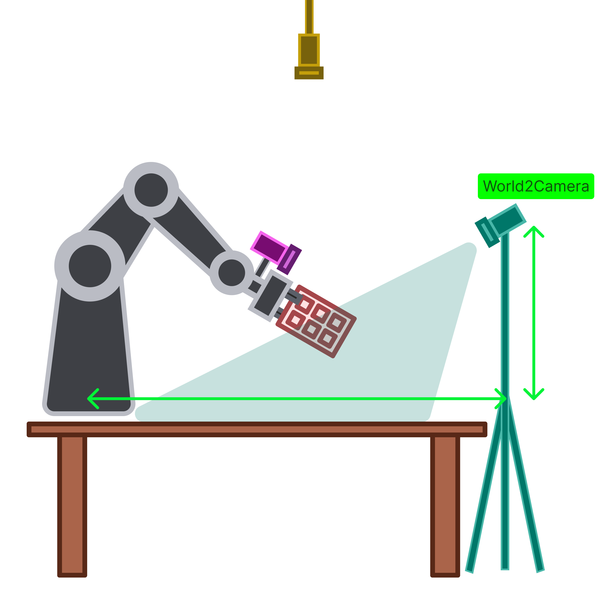

Launch  : `code/catkin_ws/src/camera_calibration/launch/external.launch`
Node  : `code/catkin_ws/src/camera_calibration/nodes/eye_to_hand_calibration.py`




## Settings
---

Config files can be found at 
```
code/catkin_ws/src/camera_calibration/config/
```

**Default Camera Configs**
Eye-in-Hand Camera @ `default_eye_in_hand.json` with **large** calibration board
Top Camera @ `cam_top_default.json` with **small** board board
Front Camera @ `cam_front_default.json` with **small** board board

Example : `eye_in_hand`
```json
{
	"board_name": "small"  // boards in boards.json
	"camera_name": "cam_top_default",  // cameras in cameras.json
	"mode": "eye_to_hand", // or eye_in_hand
	"camera_topic": "/cam_top/color/image_raw",
	"memory_size": 50,
	"load_data_directory": null, // name of file in external_calibration_data
	"save_data_directory": "cam_top" // stored in calibration_results  

```

## Start Everything // todo add full start commands
---
1. Attach ChArUco in robot hand
2. Start Camera
3. Start Arm
4. Start Rviz
5. Start Calibration
```
roslaunch camera_calibration external.launch config=cam_front_default
```

## Calibrate
---
**Controls Overview**
```
q = quit
c = collect transform
u = undo last transform 
r = estimate pose, plot and publish pose estimation
e = extensive run
s = save camera estimation
```

**Collect Transforms**
1. Move arm so that ChArUco is visible to the camera
2. Check quality
	- More blue dots = more stable estimation
	- The axis align with the board
3. Press the `[c]` key to collect transforms
4. repeat for `3` to `N` times

**Publish Estimation**
Press the `[r]` key to publish the estimation in the TF Tree
Press `[e]` for an extensive run (more plots and all solver algorithms)

**Save**
Press `[s]` to save the pose estimation to :
```
camera_calibration/calibration_results/eye_{to/in}_hand/{camera}/{filename}
```

